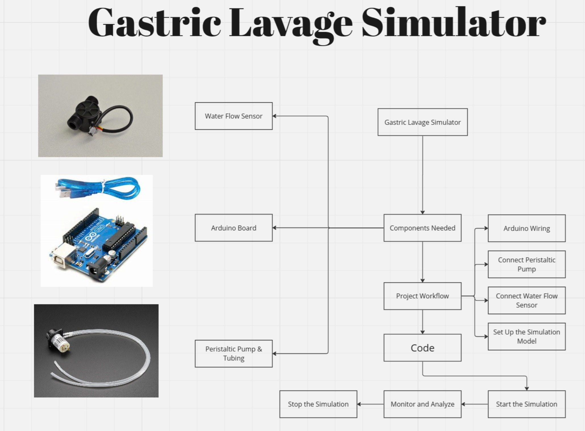

# Gastric Lavage Simulator Project
Welcome to the Gastric Lavage Simulator project!

## Description
The Gastric Lavage Simulator is designed to simulate the medical procedure of gastric lavage, providing a hands-on and visual learning experience for medical students and professionals.

## 

## Project Report
For a detailed report on the Gastric Lavage Simulator Project, please refer to the [Project Report ](ProjectReport.pdf).

## Project Planning

## Project Steps and Workflow

1. Set up the Simulation Model
2. Connect Water Flow Sensor
3. Connect Peristaltic Pump
4. Arduino Wiring
5. Write Arduino Code
6. Start the Simulation
7. Monitor and Analyze
8. Stop the Simulation

## Components Used

- Arduino Board
- Water Flow Sensor
- Peristaltic Pump
- Tubing
- Simulated Stomach Container
- Start/Stop Button
- LCD Display (Optional)

## Why This Project is the Best

The Gastric Lavage Simulator stands out as the best educational tool due to:

- Realistic Simulation: Mimics the actual gastric lavage procedure.
- Hands-On Learning: Provides a practical, hands-on experience for learners.
- Customizable and Expandable: Can be enhanced with additional sensors and features.
- Interactive User Interface: Includes an intuitive UI for easy control and monitoring.
- Educational Value: Offers a comprehensive understanding of gastric lavage principles.

## Getting Started

Follow the [video link](https://drive.google.com/file/d/1I8HfTiA9kVP-dUlmKWVhIholbhqmzK7l/view?usp=sharing) to see a demonstration of the project.

## Contributors

1. Amr Doma 
2. Tarek Walid 
3. Youssef Ahmed ِAfifi
4. Mahmoud Mohamed Abdelfatah
